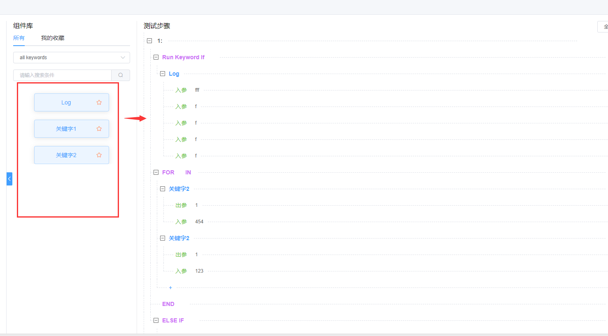

# vue笔记
- [dayjs使用](#dayjs使用)

## dayjs使用
``` js
//获取时间，当前日期往上追溯一个月方法
getPrevMouthTime() {
      let startTime =
        this.$dayjs()
          .subtract(1, 'month')
          .format('YYYY-MM-DD') + ' 00:00:00'
      this.formData.intervalTime.push(startTime)
     
    },
    getNowTime() {
      let endTime = this.$dayjs().format('YYYY-MM-DD') + ' 23:59:59'
      this.formData.intervalTime.push(endTime)
    },
// 取当前日期上一个月，整取到月份
     this.formData.month = this.$dayjs()
        .subtract(1, 'month')
        .format('YYYYMM')
```
## el-tree展开节点方式总结：
```js
// --更新节点后，以RF自动化关键字业务为例--
    updateTree() {
    //展开的节点-提供给default-expanded-keys
      this.pid = []
      this.treeRootNode.childNodes = []
      this.pid.push(this.projectId)
      this.pid.push(this.parentId)
      // 获取当前节点路径，节点逐层打开，
      //获取当前节点之上的节点结构-路径。getNodePath，参数是node节点的data数据
      //this.nodePath = this.$refs.tree.getNodePath(data)
      if (this.nodePath && this.nodePath.length > 0) {
        this.pid.push(...this.nodePath.map(item => item.id))
      }
      this.updateTreeNode(this.treeRootNode)
      this.isKeyWordNode = false
      // 保持节点展开
      setTimeout(() => {
        this.$nextTick(() => {
          this.$refs.tree.setCurrentKey(this.dialog.data.id)
          if (this.dialog.data) {
          //根据当前节点id获取对应的node层。
            var hightLineNode = this.$refs.tree.getNode(this.dialog.data.id)
          }
          if (hightLineNode) {
            hightLineNode.data.source = 'editCreateIterfaceTemplate'
            this.handleClickNode(hightLineNode.data, hightLineNode)
          }
        })
      }, 1000)
```
## JDBC 组件变量名
```js
// --JDBC 组件变量名填写规则--
const validateVariableName = (rule, value, callback) => {
      if (this.jdbcForm && this.jdbcForm.variableName) {
        let EnCharCount = this.jdbcForm.variableName.split(',').length - 1
        let CnCharCount = this.jdbcForm.variableName.split('，').length - 1
        if (CnCharCount > 0) {
          callback(new Error('多个变量时，以半角逗号分隔'))
        } else if (EnCharCount > 0) {
          let douCount = this.jdbcForm.variableName.split(',')
          let nullStrCount = 0
          for (let i = 0; i < douCount.length; i++) {
            const item = douCount[i]
            if (!item) {
              callback(new Error('逗号前后参数不可为空'))
              nullStrCount += 1
              break
            }
          }
          if (nullStrCount == 0) {
            callback()
          }
        } else {
          callback()
        }
      } else {
        callback()
      }
    }
```


## mock入参填写规则
```js
// --mock入参填写规则--
<el-input
    v-model.trim="formData.componentArgs"
    clearable
    placeholder="若入参不唯一，以半角逗号分隔"
    maxlength="128"
    @change="changeComponentInput(formData.componentId)"
    :onkeyup="formData.componentArgs.replace(/\s+/g, '')"
></el-input>
//需要改写成：
           :onkeyup="
              (function() {
                keywordForm.keywordName.replace(/\s+/g, '')
              })()

//文本输入内容不包含特殊符号，以半角逗号分隔，逗号前后参数不可为空
   const validateVariableName = (rule, value, callback) => {
      if (this.formData) {
        if (value) {
          let EnCharCount = value.split(',').length - 1
          let CnCharCount = value.split('，').length - 1
          if (CnCharCount > 0) {
            callback(new Error('多个变量时，以半角逗号分隔'))
          } else if (EnCharCount > 0) {
            let douCount = value.split(',')
            let nullStrCount = 0
            for (let i = 0; i < douCount.length; i++) {
              const item = douCount[i]
              if (!item) {
                callback(new Error('逗号前后参数不可为空'))
                nullStrCount += 1
                break
              }
            }
            if (nullStrCount == 0) {
              if (containSpecial(value)) {
                callback(new Error('不能包含特殊符号'))
              } else {
                callback()
              }
            }
          } else if (containSpecial(value)) {
            callback(new Error('不能包含特殊符号'))
          } else {
            callback()
          }
        } else {
          callback(new Error('请输入入参'))
        }
      } else {
        callback()
      }
    }
```


## 输入大于1的整数
```js
// --输入大于1的整数--
var validateCacheNumber = (rule, value, callback) => {
      var patrn = /^([1-9]\d*)(\.\d*[1-9])?$/
      if (value == '') {
        callback(new Error('请输入缓存值'))
      }
      if (typeof Number(value) === 'number' && !isNaN(value)) {
        if (Number(value) <= 1) {
          callback(new Error('请输入大于1的整数'))
        } else {
          if (!patrn.exec(value)) {
            callback(new Error('请输入非0开头的数字'))
          } else {
            callback()
          }
          callback()
        }
      } else {
        callback(new Error('请输入数字'))
      }
    }
```
## 自动刷新
```js
// --自动刷新--
 handleAutoRefresh(value) {
      if (value) {
        this.autoRefreshInterval = setInterval(() => {
          this.getBuildResultList()
        }, 5000)
      } else {
        clearInterval(this.autoRefreshInterval)
      }
    },
```
## 树拖拽功能 -关键字仓库

功能说明：普通div拖拽到树节点
思路：
1、使用原生H5拖拽事件dragstart、dragend事件 
2、将拖动的元素，构造成一个treeNode节点格式
3、该构造出来的treeNode节点 分别触发el-tree的tree-node-drag-start、tree-node-drag-end事件
4、搭配el-tree内部的allow-drop、allow-drag、node-drag-end 事件，来制定该元素的推拽规则
具体做法如下：
```js
// --run--
//1、componentLib 子组件

dragstart(event, row) {
    this.$set(row, 'popshow', false)
    this.$emit('component-dragstart', { event, row })
},
dragend(event, row) {
    this.$emit('component-dragend', { event, row })
},
//父组件转发
    componentDragstart(dragData) {
      this.$refs['treeLine'].appnedNode(dragData)
    },
    componentDragend(dragData) {
      this.$refs['treeLine'].componentDragend(dragData)
    }
// 2、el-tree 所在子组件
appnedNode(eventData) {
    //构造一个treeNode节点 
    let treeNodeData = {
        id: +new Date(),
        name: eventData.row.keywordName,
        ragendType: 'out',
        type: eventData.row.type,
        children: []
    }
    this.$refs['tree'].append(treeNodeData)
    let treeNode = this.$refs['tree'].getNode(treeNodeData)
    this.$refs['tree'].$emit('tree-node-drag-start', eventData.event, { node: treeNode })
},
 componentDragend(eventData) {
      this.$refs['tree'].$emit('tree-node-drag-end', eventData.event)
      this.$store.commit('setIsDragKeyword', true)
      //弹窗
      let obj = {
        keywordId: eventData.row.id,
        keywordType: eventData.row.type,
        outParam: eventData.row.outParam,
        libraryId: eventData.row.parentId,
        inParam: eventData.row.inParam,
        type: eventData.row.type,
        inParamValueList: [],
        isDrag: true
      }
      this.$refs.teststepDialog.openStepDialog('add', obj)
    },
// 3 同时搭配el-tree 的allow-drop、allow-drag、node-drag-end 事件
// allow-drop--拖拽时判定目标节点能否被放置
// allow-drag--判断节点能否被拖拽
// node-drag-end--拖拽结束时（可能未成功）触发的事件
```
## el-input 使用 回车键会刷新页面的问题
使用el-input的时候，光标聚焦在输入框，按下回车，会刷新页面。这是因为当el-form表单中只有一个input时，按下回车建会自动触发页面的提交功能， 产生刷新页面的行为
解决办法
1. form表单内多增加一个元素，不占据位置即可
```js
<el-form :model="form" ref="formRef" :inline="true" >
  <el-form-item label="姓名" prop="name" >
    <el-input v-model="form.name" placeholder="请输入品名" @keydown.enter="handleQuery" />
  </el-form-item>
  // form表单内多增加一个元素，不占据位置即可
  <div></div>
</el-form>
```
2. 如下代码，在 el-form 中 加个 @submit.native.prevent，就可以了，
@submit: 表单提交
.native 绑定系统原生事件
.prevent 提交以后不刷新页面
```js
// 在 el-form 中 加个 @submit.native.prevent
<el-form :model="form" ref="formRef" :inline="true" @submit.native.prevent>
  <el-form-item label="姓名" prop="name" >
    <el-input v-model="form.name" placeholder="请输入品名" @keydown.enter="handleQuery" />
  </el-form-item>
</el-form>
```
## vue在input中输入后，按回车提交数据
 @keyup.enter.native
```js
<el-input v-model="toAddNameText" @keyup.enter.native="toAddName()" placeholder="回车，即新增该竖杆名称" clearable></el-input>
```
## el-form 表单的清除校验和重置数据
```js
this.$refs.nodeTypeForm.clearValidate()
this.$refs[formName].resetFields()

this.$refs.form.validate(valid => {
        if (valid) {
        } else {
          return false
        }
      })

```

## 时间选择器
```js
<el-date-picker
v-model="form.timeValue"    
type="daterange"    
:picker-options="pickerOptions" // 配置这里     
:clearable="false"       
value-format="yyyy-MM-dd"        
range-separator="至"       
start-placeholder="开始日期"      
end-placeholder="结束日期">
</el-date-picker>

pickerOptions: {
    disabledDate (time) {
        return time.getTime() < Date.now() // 选当前时间之后的时间            return time.getTime() > Date.now() // 选当前时间之前的时间          }
    },
    // --设置只能选择当前日期及之后的日期--
pickerOptionsStart: {
        disabledDate(time) {
        //如果没有后面的-8.64e7就是不可以选择今天的
          return time.getTime() < Date.now() - 8.64e7
        }
      },
```

## vue-在scss中使用data的变量
需要把el-progress的文字跟随主题色，直接写行内样式不生效，以下解决
```js
<template>
  <div class="TimeCountDown">
    <el-progress
      class="progress"
      type="circle"
      :format="format"
      :percentage="percentage"
      :color="themeColor"
      :style="cssVars"
    ></el-progress>
  </div>
</template>

```
computed 计算属性里定义
```js
computed: {
    ...mapGetters(["language", "themeColor"]), // 主题色存在vuex里了
    cssVars() {
      return {
        "--color": this.themeColor || red,
      };
    },
  },

// 另一种写法get set
mirrorCode: {
      get: function() {
        return this.data.respJsonStr
      },
      set: function(newVal) {
        return newVal
      }
    },
```
css里
```js
<style lang="scss">
.progress {
  .el-progress__text {
    color: var(--color); // 解决
  }
}
</style>
```
## watch 监听
```js
// --watch 监听 深度监听且立即修改 分区索引 同步编辑时，外部组件数据变更，内容子组件也要深度修改数据--
watch: {
    value: {
      immediate: true,
      deep: true,
      handler(newV, oldV) {
        this.initTableData()
      }
    }
  },
```
## 表单增加提示图标
```js 
 <el-form-item :label-width="formLabelWidth" prop="funcType">
    <span slot="label">
        <span>函数类型</span>
            <el-tooltip class="item" effect="dark" placement="top">
            <div slot="content">
                <p class="hoverTipText pd-bottom16">每种子系统类型可使用的脚本，规则如下：</p>
                <ul>
                    <li><b>接口: </b>Python</li>
                    <li><b>App: </b>Python、Webdriver</li>
                    <li><b>Web:</b> Python、Webdriver、JS</li>
                </ul>
                </div>
            <el-button type="text" class="el-icon-question"></el-button>
            </el-tooltip>
        </span>
        <el-select
            v-model.trim="functionForm.funcType"
             @change="updateFunctionList()"
            placeholder="请选择函数类型"
            style="width: 100%"
        >
            <el-option
                v-for="item in functionTypeOption"
                :label="item"
                :value="item"
                :key="item"
            ></el-option>
        </el-select>
 </el-form-item>

<el-form-item v-if="jdbcForm.scriptType === 1" prop="variableName">
          <span slot="label">
            <span>变量名</span>
            <el-popover placement="top" width="230" trigger="hover">
              <div style="width:230px">
                <p class="hoverTipText"><b>作用：</b>用于存储select语句返回的数据。</p>
                <p class="hoverTipText">
                  <b>填写方式：</b
                  >一个变量存储一列的返回数据，返回的数据有多列时，可以用半角逗号分割，使用空格跳过列。
                </p>
              </div>
              <el-button type="text" class="el-icon-question" slot="reference"></el-button>
            </el-popover>
          </span>
          <el-input
            v-model.trim="jdbcForm.variableName"
            placeholder="多个变量时，以半角逗号分隔"
            type="text"
            maxlength="255"
            show-word-limit
            clearable
          ></el-input>
        </el-form-item>
```
## jsx el-table 写法
```js
// --jsx el-table 写法--
export default {
  name: 'table-demo',
  data() {
    return {
      tableData: [
        {
          date: '2016-05-02',
          name: '王小虎',
          address: '上海市普陀区金沙江路 1518 弄',
        },
        {
          date: '2016-05-04',
          name: '王小虎',
          address: '上海市普陀区金沙江路 1517 弄',
        },
        {
          date: '2016-05-01',
          name: '王小虎',
          address: '上海市普陀区金沙江路 1519 弄',
        },
        {
          date: '2016-05-03',
          name: '王小虎',
          address: '上海市普陀区金沙江路 1516 弄',
        },
      ],
      tableOptions: [
        {
          prop: 'date',
          label: '日期',
        },
        {
          prop: 'name',
          label: '姓名',
        },
        {
          prop: 'address',
          label: '地址',
          slot: ({ row }) => {
            return <el-button>{row.address}</el-button>;
          },
        },
      ],
    };
  },
  render() {
    return (
      <div>
        <h1>el-table</h1>
        <el-table data={this.tableData} style={{ width: '100%' }}>
          {this.tableOptions.map((column) => {
            const scopedSlots = column.slot
              ? {
                  default: column.slot,
                }
              : null;
            return (
              <el-table-column
                prop={column.prop}
                label={column.label}
                scopedSlots={scopedSlots}
              ></el-table-column>
            );
          })}
        </el-table>
      </div>
    );
  },
};
```
## axios 调用方法
```js
// --run--
let params = {}
this.axios
            .post('/autotest-baseconfig/sceneKeywordVersion/snapShot', params)
            .then(resp => {
            })
            .finally(() => {
            })
this.axios
            .post('/yyyth-pm-ucsvc-msvc/users/testTokens', data, {
              timeout: 30000
            })
            .then(resp => {
              this.loginSuccess = true
              let loginToken = resp
              const { userId, serverTime } = loginToken
              const diff = getTimeDiff(
                formatDate(new Date(), 'yyyy/MM/dd HH:mm:ss'),
                serverTime,
                'millisecond'
              )
              // console.log(loginToken)
              loginToken = { ...loginToken, diff: diff }
              setLsToken(JSON.stringify(loginToken))

              this.axios
                .all([
                  this.axios.get(`/yyyth-pm-ucsvc-msvc/users/${userId}`),
                  this.axios.get(
                    `/yyyth-pm-ucsvc-msvc/getMenuByRealm?systemCode=uc_center,r_d_integration`
                  ),
                  this.axios.get(`/yyyth-pm-ucsvc-msvc/getAuthById?systemCode=uc_center`)
                ])
                .then(
                  this.axios.spread((user, menu, auth) => {
                    // console.log(user, menu, auth)
                    loginHandler({
                      user_info: user,
                      access_token: loginToken.accessToken,
                      menus: menu.menus,
                      permission: auth.items,
                      tenantId: loginToken.tenantId
                    })
                  })
                )
            })
            .finally(() => {
              this.loginLoading = false
            })
```

## el-select 解决文字超长 下拉框超出屏幕
```js
// --run--
<el-select
          class="select-width"
          :popper-append-to-body="false"
          v-model="form.parentId"
          style="width: 100%;"
          filterable
          clearable
          placeholder="请选择主题场景类型"
          :disabled="dialogData.clickType === 'add'"
          @change="changeForm"
        >
          <el-option
            v-for="item in parentNameList"
            :key="item.parentId"
            :label="item.parentName"
            :value="item.parentId"
          >
          </el-option>
        </el-select>

::v-deep .select-width {
  .el-select-dropdown.el-popper {
    max-width: 640px !important;
  }
}
```

## el-tree 树节点文本超长且后方跟随按钮显示处理
```js
// --run--
<el-tree
      node-key="powerId"
      v-loading="treeLoading"
      class="filter-tree"
      ref="tree"
      :load="loadNode"
      lazy
      :props="props"
      :default-expanded-keys="pid"
      :expand-on-click-node="false"
      :highlight-current="true"
      @node-click="handleClickNode"
    >
      <span class="el-tree-node custom-tree-node" slot-scope="{ node, data }">
        <span class="custom-tree-node__label">
          <span class="el-tree-node__label">
            <span :title="data.powerName" class="tree-text">
              <!-- <i v-if="node.level == 1 || data.keywordType == 0" class="el-icon-folder"> </i>
              <i v-if="data.keywordType == 1" class="el-icon-s-operation"></i>
              <i v-if="data.keywordType == 2" class="el-icon-document"></i> -->
              {{ data.powerName }}
            </span>
          </span>
        </span>
        <span class="el-tree-node__custom" v-if="node.level < 6">
          <el-button
            type="text"
            size="mini"
            icon="el-icon-plus"
            title="添加"
            @click.stop="() => openTreeDialog('add', node, data)"
          >
          </el-button>
          <el-button
            v-if="node.level > 1"
            type="text"
            size="mini"
            icon="el-icon-edit"
            title="编辑"
            @click.stop="() => openTreeDialog('edit', node, data)"
          >
          </el-button>
          <el-button
            v-if="node.level > 1"
            type="text"
            icon="el-icon-delete"
            size="mini"
            title="删除"
            @click.stop="() => removeNode(node, data)"
          >
          </el-button>
        </span>
      </span>
    </el-tree>

    <style lang="scss" scoped>
::v-deep {
  .custom-tree-node {
    display: flex;
    width: calc(100% - 30px);
    max-width: 100%;
    .custom-tree-node__label {
      overflow: hidden;
      text-overflow: ellipsis;
      white-space: nowrap;
    }
  }
}
</style>
```
## el-tooltip框文本提示使用
```js
// --run--
<el-tooltip placement="top">
    <div slot="content">{{ item.sceneName }}</div>
   <span class="title">{{ item.sceneName }}</span>
</el-tooltip>

```
## 根据文本长度动态显示tooltip 组件封装
```js
// --run--
text-tooltip.vue

<template>
  <div class="text-tooltip">
    <el-tooltip
      class="item"
      effect="dark"
      :disabled="isShowTooltip"
      :content="content"
      placement="top"
    >
      <p class="over-flow" :class="className" @mouseover="onMouseOver(refName)">
        <span :ref="refName">{{ content || '-' }}</span>
      </p>
    </el-tooltip>
  </div>
</template>

<script>
export default {
  name: 'textTooltip',
  props: {
    // 显示的文字内容
    content: {
      type: String,
      default: () => {
        return ''
      }
    },
    // 外层框的样式，在传入的这个类名中设置文字显示的宽度
    className: {
      type: String,
      default: () => {
        return ''
      }
    },
    // 为页面文字标识（如在同一页面中调用多次组件，此参数不可重复）
    refName: {
      type: String,
      default: () => {
        return ''
      }
    }
  },
  data() {
    return {
      isShowTooltip: true
    }
  },
  methods: {
    onMouseOver(str) {
      debugger
      let parentWidth = this.$refs[str].parentNode.offsetWidth
      let contentWidth = this.$refs[str].offsetWidth
      // 判断是否开启tooltip功能
      if (contentWidth > parentWidth) {
        this.isShowTooltip = false
      } else {
        this.isShowTooltip = true
      }
    }
  }
}
</script>

<style lang="scss" scoped>
.over-flow {
  overflow: hidden;
  white-space: nowrap;
  text-overflow: ellipsis;
}
.wid190 {
  width: 100%;
}
p {
  margin: 0;
}
</style>

//注册到主函数
index.js

import textTooltip from './textTooltip.vue'

export default {
  install: Vue => {
    Vue.component('TextTooltip', textTooltip)
  }
}

//各组件中使用方式
 <text-tooltip :content="data.name" refName="tooltipOver">
    {{ data.name }}
</text-tooltip>
```

## 合并单元格方法
```js
// --template--


<el-table
      ref="table"
      class="spanMethodTable"
      v-loading="loading"
      :data="sceneUseCaseList"
      :span-method="handleSpanMethod"
      :cell-class-name="tableCellClassName"
      :row-key="getRowKeys"
      @select="selectFun"
      @select-all="selectFun"
      @selection-change="handleSelectionChange"
    >


data(){
    return{
        spanArr: [],
        posIndex: 0,
    }
}
// 计算需要合并的行数
    getSpanArr(data) {
      this.spanArr = []
      this.posIndex = 0
      for (let i = 0; i < data.length; i++) {
        if (i === 0) {
          this.spanArr.push(1)
          this.posIndex = 0
        } else {
          // 判断当前元素与上一个元素是否相同
          if (data[i].testSceneName === data[i - 1].testSceneName) {
            this.spanArr[this.posIndex] += 1
            this.spanArr.push(0)
          } else {
            this.spanArr.push(1)
            this.posIndex = i
          }
        }
      }
    },
    // 自定义合并单元格逻辑
    handleSpanMethod({ row, column, rowIndex, columnIndex }) {
      if (column.property === 'testSceneName') {
        const _row = this.spanArr[rowIndex]
        const _col = _row > 0 ? 1 : 0
        return {
          rowspan: _row,
          colspan: _col
        }
      }
    },
```
## axios的捕获异常方式
```js
// --1、编辑主机时的多用户名的校验--
 try {
       const response = await this.axios.post(
        '/autotest-baseconfig/host/updateHost',
        this.formData
        )
        if (response.respResult == '1') {
            this.$message.success('编辑主机成功！')
            this.subDialogData.setModifyTime = new Date().getTime()
            this.updateDialogData()
            this.confirmBtnLoading = false
        }
  } catch (err) {
   // this.$message.warning(err.message)
   console.error('捕获到异常:', err)
   console.error('异常堆栈:', err.stack)
   let tableData = this.stepData[this.currentStep]
    this.$set(element, 'status', 0)
    this.$set(tableData, index, {
        ...element,
        status: parseInt(err.response.data.respResult),
        log: err.response.data.respErrorDesc
    })
}

// --2、资产平台数据库设计批量新增功能，串行请求捕获接口（异常）日志状态

async catchTableData(element, index) {
      try {
        let tableData = this.stepData[this.currentStep]
        this.$set(tableData, index, {
          ...element,
          loading: true
        })
        let response = await this.batchSystemLibraryCopyTable(element)
        if (response.respResult == '1') {
          this.$set(tableData, index, {
            ...element,
            status: parseInt(response.respResult),
            log: response.respData,
            loading: false
          })
        }
      } catch (err) {
        let tableData = this.stepData[this.currentStep]
        this.$set(element, 'status', 0)
        this.$set(tableData, index, {
          ...element,
          status: err.response ? parseInt(err.response.data.respResult) : null,
          log: err.response.data.respErrorDesc,
          loading: false
        })
      }
    },
    batchSystemLibraryCopyTable(reqParams) {
      return this.axios.post(
        '/asset-business/database/table/batchSystemLibraryCopyTable',
        reqParams,
        {
          headers: {
            'X-Show-Error-Message': 'false'
          }
        },
        {
          timeout: 30000
        }
      )
    },
    // 同名校验
    copyCheckInfoBatch(tableData) {
      let reqParamArr = []
      for (let index = 0; index < tableData.length; index++) {
        let element = tableData[index]
        let reqParam = {
          databaseIds: element.databaseIdList,
          objectName: element.tableName,
          productId: element.productId
        }
        reqParamArr.push(reqParam)
      }
      return this.axios.post('/asset-business/database/table/copyCheckInfoBatch', reqParamArr)
    },
    // 保存功能
    async saveDbd() {
      this.stepType = 'saveDbd'
      if (await this.$refs.currentComponent.chechForm()) {
        let formData = this.$refs.currentComponent.formData
        if (!formData.productId || !formData.requirementUuid) {
          if (!formData.productId) {
            this.$message.warning('请选择产品线')
            return
          }
          if (!formData.requirementUuid) {
            this.$message.warning('请选择软需')
            return
          }
        }
        let tableData = this.stepData[this.currentStep]
        for (let index = 0; index < tableData.length; index++) {
          let element = tableData[index]
          this.$set(element, 'id', null)
          this.$set(element, 'operationType', element.operationTypeArr.join(','))
          this.$set(element, 'productId', formData.productId)
        }
        // 数据库表同名校验
        if (this.stepData[this.currentStep].length != 0) {
          let { respData } = await this.copyCheckInfoBatch(this.stepData[this.currentStep])
          for (let i = 0; i < respData.length; i++) {
            this.$set(tableData[i], 'errMsg', respData[i].errMsg)
            this.$refs.currentComponent.selectAllEvent()
          }
        } else {
          this.$message.warning('请至少选择一张表进行保存')
          return
        }

        let hasErr = tableData.filter(item => item.errMsg.tableNameErr != '')
        if (hasErr.length === 0) {
          for (let index = 0; index < tableData.length; index++) {
            let element = tableData[index]
            this.$set(element, 'loading', true)
            this.$set(element, 'requirementCode', formData.requirementCode)
            this.$set(element, 'requirementIds', formData.requirementIds)
            this.$set(element, 'requirementList', formData.requirementList)
            this.$set(element, 'requirementUuid', formData.requirementUuid)
            await this.catchTableData(element, index)
          }
        } else {
          await this.$refs.currentComponent.validTable()
        }
      }
    },
```
## el-dialog 单文件写法
```js
// --run--
//引用selectAssetDialog.vue
 <select-asset-dialog
      :title="dialog.title"
      :visible.sync="dialog.visible"
      :card-list="cardList"
      :sceneId="sceneId"
      :centerId="centerId"
      :dialog-data="dialog.dialogData"
      :source-page="dialog.sourcePage"
></select-asset-dialog>

//定义selectAssetDialog.vue
<el-dialog
    :title="title"
    :visible="visible"
    :width="sourcePage == 'tableCard' ? '1000px' : '800px'"
    @open="init"
    @close="cancle"
    :showFullscreen="false"
    :modal-append-to-body="false"
    :close-on-click-modal="false"
    :close-on-press-escape="false"
  >
  ....
   <span slot="footer">
      <el-button @click="cancle">
        取消
      </el-button>
      <el-button type="primary" @click="confirm">
        确定
      </el-button>
    </span>
</el-dialog>

props: {
    title: {
      type: String
    },
    visible: {
      type: Boolean
    },
}

init() {
      this.tableData = []
      this.page.totals = 0
      this.formData.serverName = ''
      this.organizationTree()
    },
cancle() {
      this.$emit('update:visible', false)
    },
```

## Popover 弹出框用法总结
Popover 弹出框用法总结
Popover 有四种激活方式，主要支持四种触发方式：hover，click，focus 和 manual，通过trigger属性用于设置何时触发 Popover。触发方式主要分为两种：使用 slot="reference" 的具名插槽，或使用自定义指令v-popover指向 Popover 的索引ref。
1、使用 slot="reference" 的具名插槽
```js
// --run--
<el-popover
placement="top-start"
title="标题"
width="200"
trigger="hover"
content="这是hover 激活。"
>
<el-button slot="reference">hover 激活</el-button>
</el-popover>

```
2、使用自定义指令v-popover指向 Popover 的索引ref

```js
// --run--
<el-popover
ref="popover-hover"
placement="top-start"
title="标题"
width="200"
trigger="hover"
content="这是hover 激活。"
>
</el-popover>
<el-button v-popover:popover-hover>hover 激活</el-button>
```


