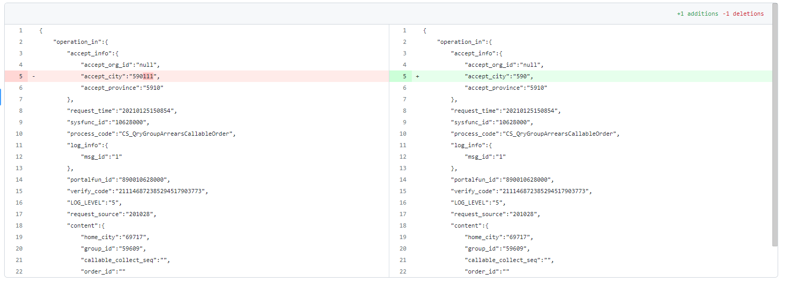

# 比对插件
## v-code-diff
1、使用 yarn add v-code-diff
2、全局引入或局部引入
3、项目中应用
```js
// --run--
    <code-diff
        v-show="showMode == 'showCodeDiff'"
        :old-string="templateForm.expectedResponseMessage"
        :new-string="templateForm.responseMessage"
        file-name="package.json"
        output-format="side-by-side"
        :max-height="fullscreen ? '625px' : '525px'"
        diff-style="char"
        context="50"
      />
```
运行效果：



## vue-codemirror代码差异对比
1、npm i vue-codemirror
npm i diff-match-patch
2、
```js
// 代码对比插件
import CodeMirror from 'codemirror'
import 'codemirror/lib/codemirror.css'
import 'codemirror/addon/merge/merge.js'
import 'codemirror/addon/merge/merge.css'
import DiffMatchPatch from 'diff-match-patch'
window.diff_match_patch = DiffMatchPatch
window.DIFF_DELETE = -1
window.DIFF_INSERT = 1
window.DIFF_EQUAL = 0
```
3、html代码使用
```js
//
<el-dialog title="差异对比" :visible.sync="editorDialog" class="history" width="60%">
      <section class="box" >
        <span>【注】左侧为历史版本，右侧为当前版本</span>
        <div id="view"></div>
      </section>
    </el-dialog>
```
4、method部分
```js
// --run--
// json对比
    initUI (value, orig) {
      if (value == null) return
      const target = document.getElementById('view')
      target.innerHTML = ''
      CodeMirror.MergeView(target, {
        value: value, // 上次内容
        origLeft: null,
        orig: orig, // 本次内容
        lineNumbers: true, // 显示行号
        mode: '',
        highlightDifferences: true,
         foldGutter:true,
        lineWrapping:true,
        styleActiveLine: true,
        matchBrackets: true, 
        connect: 'align',
        readOnly: true // 只读 不可修改 
      })
    },
```
5、操作触发上述方法,传入旧代码与新代码进行比对
```js
/** 按钮操作 */
    editor () {
      this.editorDialog = true
      // 初始化版本差异
      this.$nextTick(function () {
        var a = this.oldStr // 旧版本
        var b = this.newStr // 新版本
        this.initUI(a,b)
      })
    },

```
运行效果：


