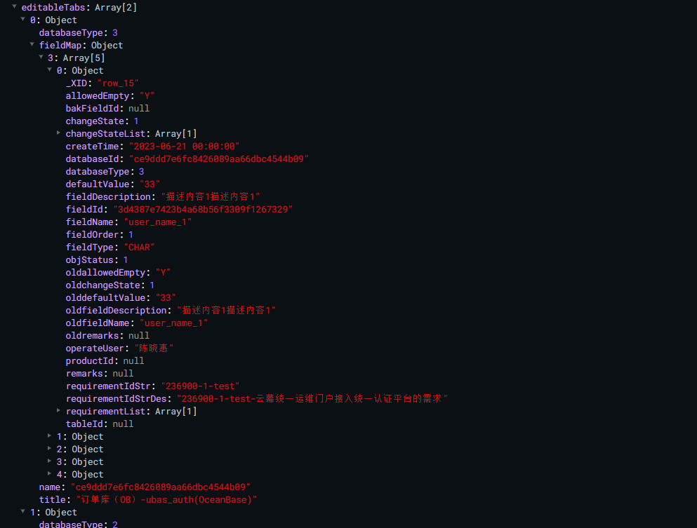

# 表字段同步编辑功能
同步编辑包含：同步新增、同步批量新增、同步修改、同步删除、同步批量删除、同步勾选和反选。
1、同步新增：开启同步编辑，点击新增按钮，多页签同步新增一条记录
2、同步批量新增：开启同步编辑，点击批量新增按钮，多页签同步新增多条记录
3、同步修改：编辑同名的一条记录，会同步修改其他页签下同名的一条记录，以单元格的维度
4、同步删除：选择删除按钮，会同步删除其他页签下同名的一条记录
5、同步批量删除：勾选了多条记录，选择批量删除按钮，会同步批量删除与当前页勾选的名字一样的记录。
6、同步勾选和反选：当前勾选了一条记录，会同步勾选其他页签下同名的一条记录。


功能实现思路：
1、设置原始值：以当前页签操作的记录去影响其他页签，需要建立相同字段名称之间的关系，设置 字段名称列 变更之前的旧值
2、寻找首次出现的下标：通过旧值一样，去寻找其他页签下相同旧值的首条记录，并传入需要改变的单元格字段，和该单元格的值。

数据结构



```js
// 设置原始字段
    setOldFiled(tableData) {
      let needFiled = [
        'fieldName',
        'allowedEmpty',
        'fieldDescription',
        'defaultValue',
        'changeState',
        'remarks'
      ]
      tableData.forEach(element => {
        needFiled.forEach(item => {
          this.$set(element, `old${item}`, element[item])
        })
      })
    },
```
```js
// 同步新增
    synchronizationInsertData(records) {
      if (this.synchronizationEdit) {
        if (records && records.row) {
          for (const key in this.editableTabs) {
            records.row.xid = Math.random()
            let databaseType = this.editableTabs[key].databaseType
            if (this.editableTabs[key].fieldMap && this.editableTabs[key].fieldMap[databaseType]) {
              this.editableTabs[key].fieldMap[databaseType].push(
                JSON.parse(JSON.stringify(records.row))
              )
            } else {
              this.editableTabs[key].fieldMap = {}
              this.editableTabs[key].fieldMap[databaseType] = []
              this.editableTabs[key].fieldMap[databaseType].push(
                JSON.parse(JSON.stringify(records.row))
              )
            }
            this.setOldFiled(this.editableTabs[key].fieldMap[databaseType])
          }
        }
      }
    },
```
```js
//执行方式 
//input框改动后，传入当前行数据，当前编辑的字段值，旧有字段名称，要改变的字段（单元格）
synchronizationChangeData(row, row.defaultValue, row.oldfieldName, 'defaultValue')

// 同步编辑
    synchronizationChangeData(currentRow, fieldNameVal, fieldNameOldVal, fieldName) {
      /**
       * currentRow -当前编辑行
       * fieldNameVal- 当前编辑的单元格 对应的字段值
       * fieldNameOldVal- 当前行的原始字段名称的值，是否同名作为标准-同名可同步修改
       * fieldName - 当前编辑的单元格 需要同步修改的字段名
       */
      if (this.synchronizationEdit) {
        this.currentRowfieldName = fieldNameVal
        for (let key = 0; key < this.editableTabs.length; key++) {
          let editableTabsItem = this.editableTabs[key]
          let databaseType = editableTabsItem.databaseType
          let tableData = editableTabsItem.fieldMap[databaseType]
          if (key == this.tabIndex) {
            this.setOldFiled(tableData)
            continue
          }
          let index = tableData.findIndex(item => item.fieldName === fieldNameOldVal)
          if (index > -1) {
            tableData[index][fieldName] = fieldNameVal
            if (fieldName == 'changeState') {
              // 同名字段，不同的变更状态改变时
              let filterChangeState = tableData[index].changeStateList.filter(
                item => item.dictIntValue === fieldNameVal
              )
              if (filterChangeState.length == 0) {
                // tableData[index] 无 fieldNameVal 对应的选项，默认取第一项
                tableData[index][fieldName] = tableData[index].changeStateList[0].dictIntValue
              }
            }
          }
          this.setOldFiled(tableData)
        }
      } else {
        for (const key in this.editableTabs) {
          let databaseType = this.editableTabs[key].databaseType
          let tableData = this.editableTabs[key].fieldMap[databaseType]
          this.setOldFiled(tableData)
        }
      }
    },
```
```js
// 同步删除
    synchronizationDeleteData(row, rowIndex) {
      for (let key = 0; key < this.editableTabs.length; key++) {
        let editableTabsItem = this.editableTabs[key]
        let databaseType = editableTabsItem.databaseType
        let tableData = editableTabsItem.fieldMap[databaseType]
        let index = tableData.findIndex(item => item.fieldName === row.fieldName)
        if (index > -1) {
          if (!this.ListContainsObj(this.editableTabsCheckRecords, tableData[index])) {
            this.editableTabsCheckRecords.push(tableData[index])
          }
          tableData.splice(index, 1)
        }
      }
    },
    // 同步批量删除
    synchronizationBatchRemove(row) {
      for (let key = 0; key < this.editableTabs.length; key++) {
        let editableTabsItem = this.editableTabs[key]
        let databaseType = editableTabsItem.databaseType
        let tableData = editableTabsItem.fieldMap[databaseType]
        let index = tableData.findIndex(item => item.fieldName === row.fieldName)
        if (index > -1) {
          // if (!this.ListContainsObj(this.editableTabsCheckRecords, tableData[index])) {
          //   this.editableTabsCheckRecords.push(tableData[index])
          // }
          tableData.splice(index, 1)
        }
      }
    },
```
```js
// 单选与反选，全选与全反选
selectChangeEvent({ checked, records, reserves, row }) {
      if (this.synchronizationEdit) {
        if (checked) {
          if (row) {
            // 同步编辑-列表中-非全选选中
            for (let i = 0; i < records.length; i++) {
              let recordsItem = records[i]
              if (!this.ListContainsObj(this.editableTabsCheckRecords, recordsItem)) {
                this.editableTabsCheckRecords.push(recordsItem)
              }
              for (let key = 0; key < this.editableTabs.length; key++) {
                let editableTabsItem = this.editableTabs[key]
                let databaseType = editableTabsItem.databaseType
                let tableData = editableTabsItem.fieldMap[databaseType]
                if (key == this.tabIndex) {
                  continue
                }
                // 过滤页签下与当前勾选记录 同名的数据
                let filterSameNameTable = tableData.filter(
                  item => item.fieldName == recordsItem.fieldName
                )
                let filterSameNameRecords = records.filter(item => item.fieldName == row.fieldName)
                if (filterSameNameRecords && filterSameNameRecords.length > 1) {
                  for (let j = 0; j < filterSameNameRecords.length; j++) {
                    const tableDataItem = filterSameNameTable[j]
                    if (!this.ListContainsObj(this.editableTabsCheckRecords, tableDataItem)) {
                      if (tableDataItem && recordsItem.fieldName == tableDataItem.fieldName) {
                        this.editableTabsCheckRecords.push(tableDataItem)
                      }
                    }
                  }
                } else {
                  // 没有同名的勾选
                  let index = tableData.findIndex(item => item.fieldName === recordsItem.fieldName)
                  if (index > -1) {
                    if (!this.ListContainsObj(this.editableTabsCheckRecords, tableData[index])) {
                      this.editableTabsCheckRecords.push(tableData[index])
                    }
                  }
                }
              }
            }
          } else {
            // 全选选中
            for (let i = 0; i < records.length; i++) {
              let recordsItem = records[i]
              if (!this.ListContainsObj(this.editableTabsCheckRecords, recordsItem)) {
                this.editableTabsCheckRecords.push(recordsItem)
              }
              for (let key = 0; key < this.editableTabs.length; key++) {
                let editableTabsItem = this.editableTabs[key]
                let databaseType = editableTabsItem.databaseType
                let tableData = editableTabsItem.fieldMap[databaseType]
                if (key == this.tabIndex) {
                  continue
                }
                for (let index = 0; index < tableData.length; index++) {
                  const element = tableData[index]
                  if (element.fieldName == recordsItem.fieldName) {
                    if (!this.ListContainsObj(this.editableTabsCheckRecords, element)) {
                      this.editableTabsCheckRecords.push(element)
                      continue
                    }
                  }
                }
              }
            }
          }
        } else {
          // 同步编辑-取消选中,当前页无任何勾选记录
          if (records.length == 0) {
            if (row) {
              // 非全选模式
              for (let key = 0; key < this.editableTabs.length; key++) {
                if (key == this.tabIndex) {
                  let dataIndex = null
                  for (let i = 0; i < this.editableTabsCheckRecords.length; i++) {
                    if (JSON.stringify(this.editableTabsCheckRecords[i]) === JSON.stringify(row)) {
                      dataIndex = i
                      break
                    }
                  }
                  this.$delete(this.editableTabsCheckRecords, dataIndex)
                  continue
                }
                let result = []
                for (let i = 0; i < this.editableTabsCheckRecords.length; i++) {
                  if (this.editableTabsCheckRecords[i].fieldName != row.fieldName) {
                    result.push(this.editableTabsCheckRecords[i])
                  }
                }
                this.editableTabsCheckRecords = result
              }
            } else {
              // 全选模式
              this.editableTabsCheckRecords = [...records]
            }
          } else {
            // 同步编辑-取消选中-去除名称相同的勾选
            for (let i = 0; i < records.length; i++) {
              let recordsItem = records[i]
              if (!this.ListContainsObj(this.editableTabsCheckRecords, recordsItem)) {
                this.editableTabsCheckRecords.push(recordsItem)
              }
              for (let key = 0; key < this.editableTabs.length; key++) {
                let editableTabsItem = this.editableTabs[key]
                let databaseType = editableTabsItem.databaseType
                let tableData = editableTabsItem.fieldMap[databaseType]
                if (key == this.tabIndex) {
                  for (let j = 0; j < this.editableTabsCheckRecords.length; j++) {
                    if (JSON.stringify(row) === JSON.stringify(this.editableTabsCheckRecords[j])) {
                      this.$delete(this.editableTabsCheckRecords, j)
                    }
                  }
                  continue
                }
                // 过滤页签下与当前取消勾选记录 同名的数据
                let filterSameNameTable = tableData.filter(item => item.fieldName == row.fieldName)
                for (let sameNameJ = 0; sameNameJ < filterSameNameTable.length; sameNameJ++) {
                  for (let recordI = 0; recordI < this.editableTabsCheckRecords.length; recordI++) {
                    if (
                      JSON.stringify(this.editableTabsCheckRecords[recordI]) ===
                      JSON.stringify(filterSameNameTable[sameNameJ])
                    ) {
                      this.$delete(this.editableTabsCheckRecords, recordI)
                      break
                    }
                  }
                  break
                }
              }
            }
          }
        }
      } else {
        // 非同步编辑模式
        if (checked) {
          // 选中
          for (let i = 0; i < records.length; i++) {
            let recordsItem = records[i]
            if (!this.ListContainsObj(this.editableTabsCheckRecords, recordsItem)) {
              this.editableTabsCheckRecords.push(recordsItem)
            }
          }
        } else {
          // 取消选中
          let dataIndex = null
          for (let i = 0; i < this.editableTabsCheckRecords.length; i++) {
            if (JSON.stringify(this.editableTabsCheckRecords[i]) === JSON.stringify(row)) {
              dataIndex = i
              break
            }
          }
          this.$delete(this.editableTabsCheckRecords, dataIndex)
        }
        if (records.length == 0) {
          var itemValue = this.databaseIdMap.get(this.activeName)
          let tableData = this.editableTabs[this.tabIndex].fieldMap[
            parseInt(itemValue.databaseType)
          ]
          for (let i = 0; i < tableData.length; i++) {
            const recordsItem = tableData[i]
            for (let j = 0; j < this.editableTabsCheckRecords.length; j++) {
              if (
                JSON.stringify(recordsItem) === JSON.stringify(this.editableTabsCheckRecords[j])
              ) {
                this.$delete(this.editableTabsCheckRecords, j)
              }
            }
          }
        }
      }
    },

```