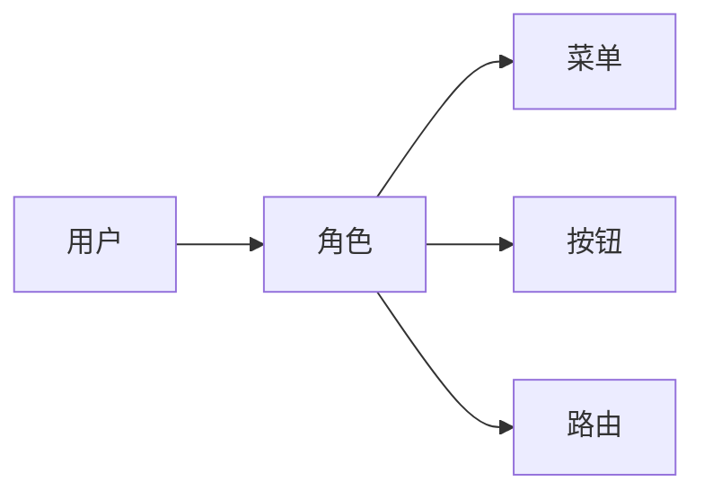

# 统一路由权限管理方案
## 现状
1. 当前的路由权限管理，首先基于vue的Router定义出所有路由信息：
```js
 {
    path: '/login',
    name: 'login',
    meta: {
      noAuth: true /* true 不需要认证 */
    },
    component: () => import(/* webpackChunkName: "Login" */ './views/login/Login.vue')
  }
```
2. 对于`noAuth: false`的路由，需要在页面配置菜单权限：


3. 算法实现简述
```js
router.beforeEach((to, from, next) => {
 if (!to.meta.noAuth) {
     if (token) {
         // 获取匹配到的路由信息，并截取掉动态参数
         const toPath = to.matched.slice(-1)[0].path.split('/:')[0]
            // 判断截取后的路径是否在配置的菜单路径中
            if (!store.state.paths[toPath]) {
            $message.error('您没有权限访问该页面!')
            next({
              path: from.path
            })
            store.commit('setTabLoading', false)
            NProgress.done()
      } 
     }
 }
}
```
## 问题
1. 页面配置的是菜单路径，一般为一个业务的前缀，无法细粒度控制路由权限。毕竟菜单路径只是所有路由中的子集。

2. `const toPath = to.matched.slice(-1)[0].path.split('/:')`对匹配的路由路径进行简单截取，不支持动态参数在中间的情况，如：`/school/:id/class/:classId`。存在一些使用限制。
3. 子应用的路由权限管理不了，因为依赖Vue Router实现，获取不到子应用的router定义，`to.matched`匹配不到路径。
4. 业务边界不清晰，当前菜单管理功能其实应该只是控制各个角色对菜单的可见性，路由的权限控制不应该依赖菜单来校验。应该独立模型控制，如：


## 建议方案
1. 主应用添加路由权限管理功能，配置页面参照当前的【菜单管理】功能做扩展。
```js
// 配置路由对象示例
{
    path: '/school/:id/class/:classId',
    name: '获取指定学校的班级信息',
    subapp: '',// 路由所属子应用
    type: 'router' //类型分为 button、menu、router    
}
```
2. 加载配置到 vue store
3. 算法实现样例
```js
function pathToReg(path, exactMatch) {
// 实现转换Vue的router path为正则表达式
}

router.beforeEach((to, from, next) => {
 if ((to.meta && !to.meta.noAuth) || !to.meta) {
     if (token) {
         // 获取访问的完整地址，如：/school/1/class/101
         const toPath = to.path
         //  遍历配置的所有路由地址
         for (let configPath in store.state.paths) { 
             // path=/school/:id/class/:classId
             // 转化path为正则表达式，pathReg=/^\/school\/[^/]+\/?\/class\/[^/]+\/?/i
            const pathReg = pathToReg(configPath)
             // 使用转换的正则匹配用户的访问路径
            const hasAuth = pathReg(toPath)
            if (!hasAuth) {
                $message.error('您没有权限访问该页面!')
                next({
                path: from.path
                })
                store.commit('setTabLoading', false)
                NProgress.done()
            }
        }           
      } 
     }
 }
}
```
## 展望
因为实现了路由的管理能力，后续可以基于该功能做动态路由，用户登陆后获取该用户自己的路由信息。