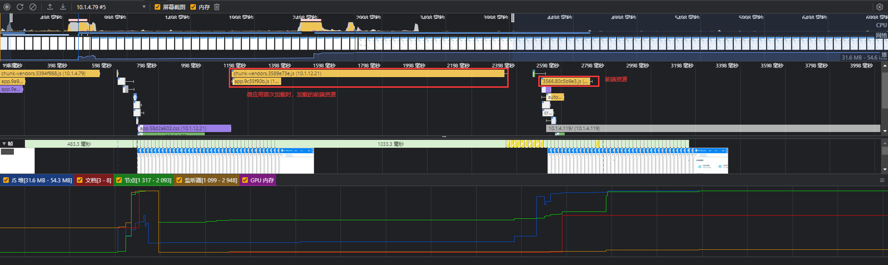
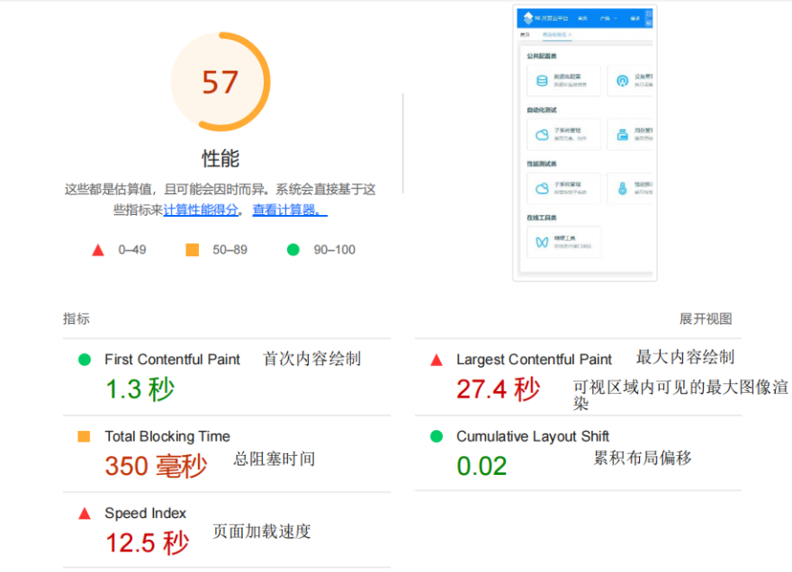

# 自动化导览性能分析

#### 导览页面总的性能分析图

#### 业界性能指标参考
| 指标 | 快 | 中 | 慢 |
|:-- |:-- |:-- |:-- |
| First Contentful Paint （首次内容渲染时间）  | 0~1.8s | 1.8~3s |>3s |
| First Meaningful Paint（首次有效绘制时间） | 0~2s | 2~4s |>4s |
| Speed Index（页面加载速度） | 0~3.4s | 3.4-5.8s |>5.8s |
| First CPU Ildle（首次CPU空闲）| 0~4.7s | 4.8~6.5s |>6.5s |
| Time to Interactive （可交互时间） | 0~3.8s | 3.9~7.3s |>7.3s |
| Max Potential First Input Delay（首次输入延迟） | 0~130ms | 130~250ms |>250ms |
| Total Blocking Time（总阻塞时间） | 0~200ms | 0~200ms |600ms |
| Largest Contentful Paint （最大内容绘制时间） | 0~2.5s | 2.5~4s |4s |

<b>结论</b>

分两种情况：
1. 首次访问无任何微应用时，初次加载自动化导览页面时，除了要加载主应用资源，耗时在1.5秒左右，触发请求微应用所需的资源包占据时间将近有2.24秒
2. 当加载过任一微应用页面，再加载导览页面，就没有第一次的卡顿现象。

卡顿问题不在导览页面本身，而在于首次加载微应用的时候，资源加载时间的消耗上。

### 解决方案
1. 启动文本压缩，对于文本资源，应先压缩（gzip、deflate 或 brotli），然后再提供，以最大限度地减少网络活动消耗的字节总数
2. 减少未使用的 JavaScript，并等到需要使用时再加载脚本，以减少网络活动耗用的字节数
3. 以内嵌方式提供关键的 JS/CSS，并推迟提供所有非关键的 JS/样式，移除阻塞渲染的资源

